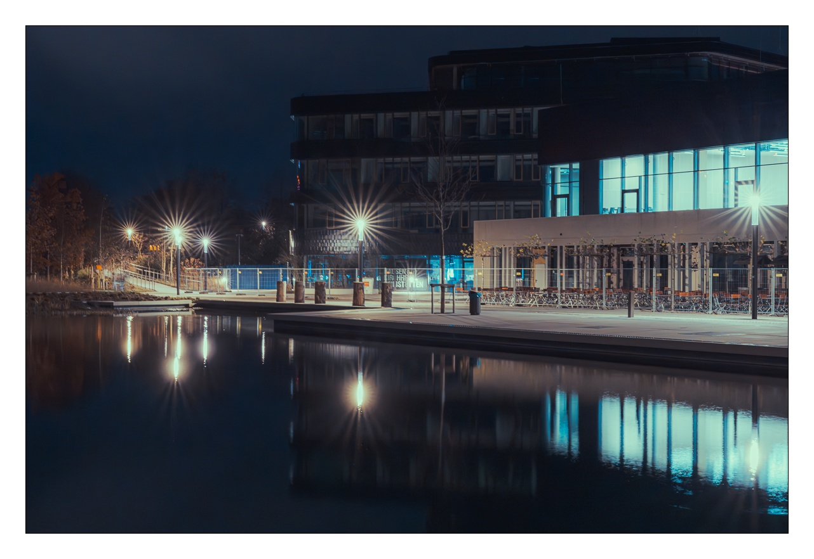
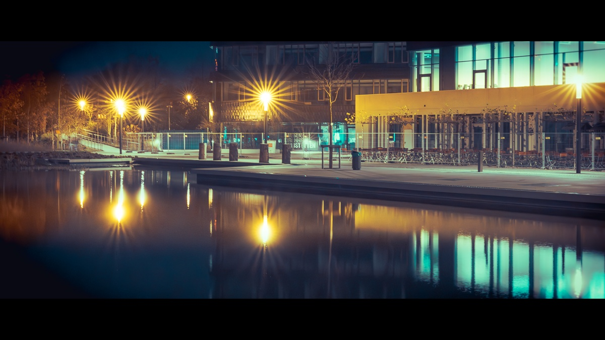
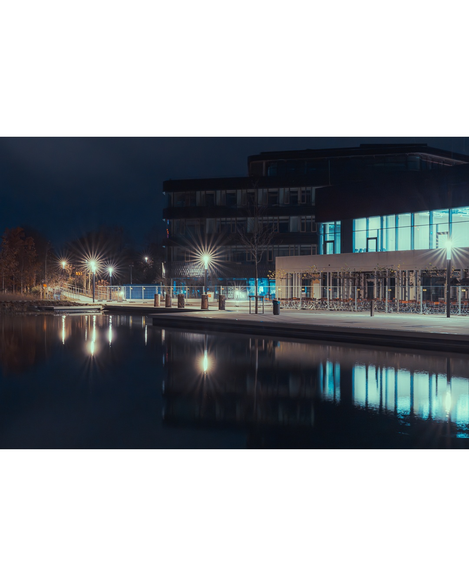

# Image Processing Script

This script processes images based on their aspect ratio and configuration settings. It can add borders, resize images to fit Instagram frame dimensions, and apply a letterbox effect. The script reads configuration options from a `config.ini` file.

## Configuration Options

The configuration is defined in the `config.ini` file and includes the following sections:

### [common]
- `quality`: The quality of the saved image (ignored for JPEG). Default is `95`.
- `export_exif`: A boolean value indicating whether to export EXIF data. Default is `True`.
- `extension`: The file extension for the saved image. Options are `jpeg` or `png`. Default is `jpeg`.
- `insta`: A boolean value indicating whether to apply the Instagram frame effect. Default is `True`.

### [letterbox]
- `format`: The aspect ratio format for the letterbox effect. Default is `16:9`.

## Usage

Install the python packages from requirements.txt in a venv or globally.
Adapt the shebang in `frmr.py` if necessary.

`chmod +x frmr.py`

Run the script on a bunch of photos:

`./frmr.py *.tif`

## Examples

Here are some example images processed by the script:

### Normal Output

### Letterbox

This setting is applied if a 2,35:1 image is processed

### Insta Dimensions

Optionally, the script also puts the image inside a 5:4 white rectangle which can be uploaded to Instagram.
Probably Instagram likes 5:4 images better than other dimensions.
Probably

